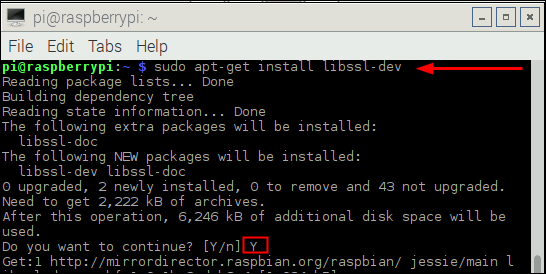

## Configure your device ##

Almost done! It's finally time to put everything together on your RaspberryPi and set up the connection.

(Full official tutorial for developing your device software can be found [here](https://docs.oracle.com/en/cloud/paas/iot-cloud/iotgs/developing-device-software-using-client-software-libraries1.html "Developing Device Software Using the Client Software Libraries"), or follow this [QuickStart tutorial](http://www.oracle.com/webfolder/technetwork/tutorials/obe/cloud/iot/IoT%20Quick%20Start%20CPOSIX/IoTQuickStartCPOSIX.html "POSIX Application on a Raspberry Pi").)

To make things easier, we have prepared some sample code which you can download directly to the RaspberryPi using Git.

1. Find the **IP-address** of your RaspberryPi using **nmap** (for example: `nmap -v -sn 192.168.1.0/24`). If you are using one of the provided ones, they are clearly marked with an alias (Ripan, Viggen, Ugglan...), making them earier to identify. Note the IP-adress.
2. Open the [Oracle IoT Cloud Service Client Software Library downloads page](http://www.oracle.com/technetwork/topics/cloud/downloads/iot-client-libraries-2705514.html).
3. Locate the Binary file for C POSIX Client Software Library and download the zip file .
4. You now want to copy your downloaded **provisioning file** and the **Software library zip file** to the RaspberryPi, to your RaspberryPi's home directory (/home/pi). We suggest using FileZilla or sftp.  Use the provided credentials for the borrowed RaspberryPis.
5. Now, SSH to your device. If you are on a windows computer, we suggest using Putty.
6. Enter the following command. If you're asked if you want to continue during the installation, answer Y.  
   `sudo apt-get install libssl-dev`  
     
6. Enter the following command:  
   `export IOTCS_OS_NAME="Raspbian GNU/Linux"`  
   The variable os_name is a name used to get the activation policy.  
6. Enter the following command:  
   `export IOTCS_OS_VERSION="8"`
   The variable os_version is a number used to get the activation policy.
6. Navigate back to the home directory (/home/pi).
7. Use the unzip command to extract the content of the iotcs-csl-posix-bin-release.zip file. The files are extracted into the subdirectory iotcs.  
     
8. To get the sample code: Clone the github repository by entering : `git clone https://github.com/DiscoTechOracle/IoT-Meetup.git`
9.  

You have now successfully registered your RaspberryPi as a device in the IoT Cloud Service! Time for the next step!

### [Configure your device to connect to the IoT Cloud Service server](configure.md) ###
