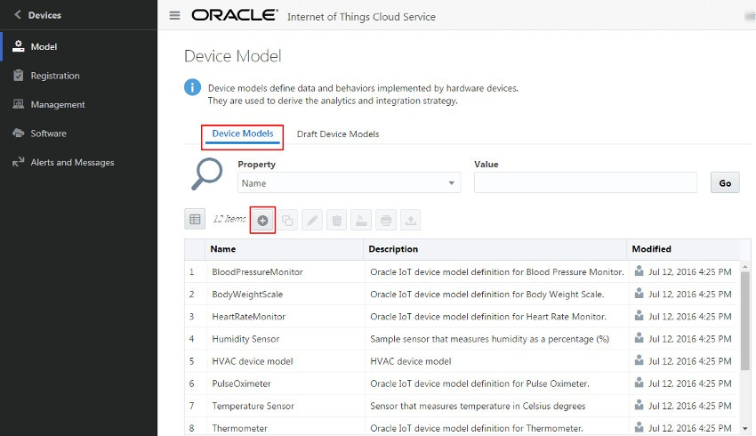

# Part 1: Configure the Cloud Service #

## Create a device model ##

Before anything else, you will need to **_define a model_** for your RaspberryPi in the IoT Cloud Service (IoT CS). 

A device model gives the IoT CS access to the resources and capabilities provided by a specific device type. Your RaspberryPi will need to identify and be registered as at least one device model to be able to send data to the IoT CS.

(To learn more, see [About Device Models in Oracle IoT Cloud Service](https://docs.oracle.com/en/cloud/paas/iot-cloud/iotgs/device-models-oracle-iot-cloud-service.html "About Device Models in Oracle IoT Cloud Service").
Full official tutorial on how to add a new Device Model can be found [here](https://docs.oracle.com/en/cloud/paas/iot-cloud/iotgs/creating-new-device-model.html "Creating new Device Model"). )

### Login ###

To sign in to Oracle IoT Cloud Service:
1. Open a web browser and open the **console** using the provided address (similar to https://your-IoT-instance-here.oraclecloud.com/ui ).
2. When prompted, enter the provided credentials and click **Sign In**.

### To create your team's new device model:

1. Login to the IoT Cloud Service using provided credentials.
2. Once logged in, click the **Main Menu** icon (), then select **Devices**, and then select **Models**.
3. Click **Device Models** on the right pane and then the Add button  in the Device Model page, as shown below.
   
   
4. Enter the values for the **Name**, **Description**, and **URN** text fields. 
   Name will be the alias for your RaspberryPi in the IoT CS, please mark down with your **team name** and put for example your **team slogan** in the description.
   
   The URN is special. When your RaspberryPi sends messages, it will use this as a kind of URL. By posting to the URN, the IoT service will know what type of metadata the message will contain. 
   
   Please enter the following **URN**: _urn:com:discotechoracle:devices:**TeamName**_
5. Now it's time for _custom attributes_! If you are using the provided sensors, they will measure **temperature** and **humidity**.
  * Click the Add button  in the **Custom Attributes** section.
  * Under **Name**, enter **temperature**, and as **Type**, choose **Number**
6. Repeat step 5, but use **humidity** instead of temperature. 

7. Optional. Create the possibility for the device to send alerts by adding **Alerts and Custom Data Messages**
8. Click **Save** in the upper-right corner. If you've done all steps above, the newly created device model is added to the Device Model table. Please **double check** it's there and that all data entered is correct. 

### All done? Time to [create your IoT application](createapplication.md)! ###
